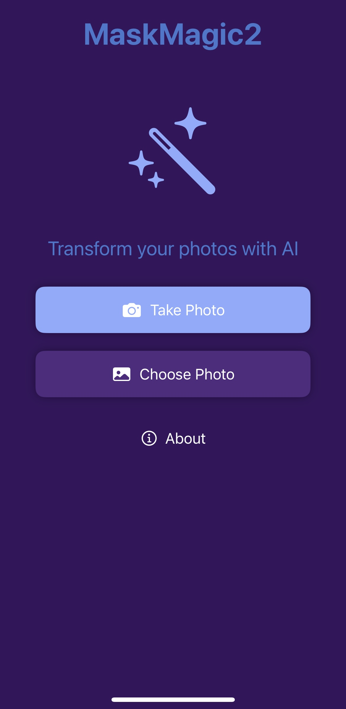

# MaskMagic2

MaskMagic2 is an iOS application that uses AI to edit and transform images through an intuitive masking interface. Simply select an image, create a mask, and let AI generate amazing transformations.

## Features

- 📱 Clean SwiftUI interface with modern design
- 🎭 Simple masking tools to select areas for transformation
- 🧠 AI-powered image generation via OpenAI API
- 🔒 Secure API handling using Google Cloud Functions
- 🖼️ Support for different image orientations

## Screenshots

  
  
  

## Installation

1. Clone this repository
2. Open `MaskMagic2.xcodeproj` in Xcode
3. Configure API keys (see below)
4. Build and run on your device or simulator

### API Key Configuration

This app uses Google Cloud Functions to securely handle API requests. To set up your own instance:

1. Create an OpenAI API key
2. Set up a Google Cloud Function to handle secure API requests
3. Update the API endpoint in `Configuration.swift`

## Technologies Used

- SwiftUI for the user interface
- Combine framework for reactive programming
- OpenAI API for image generation
- Google Cloud Functions for secure API key management

## Current Development Focus

- Improving image orientation preservation during processing
- Enhancing AI image generation quality and reliability 
- Refining user experience and interface

## License

This project is licensed under the MIT License - see the LICENSE file for details.

## Acknowledgments

- Thanks to OpenAI for providing the image generation API
- Thanks to all contributors who have helped with testing and feedback
